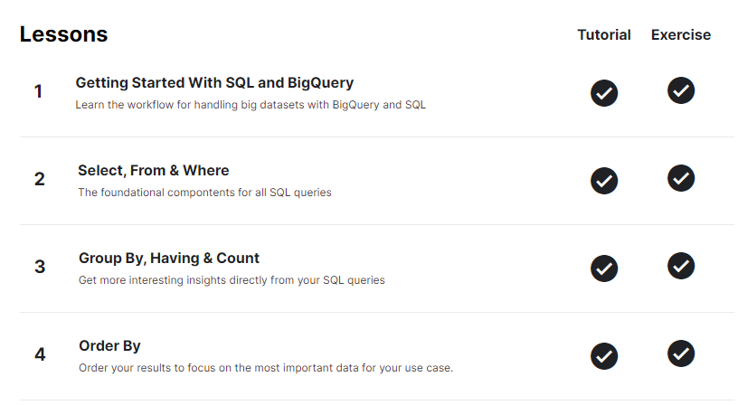
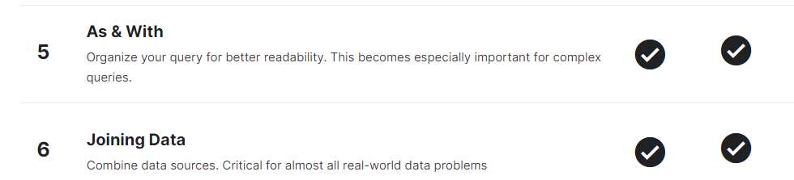
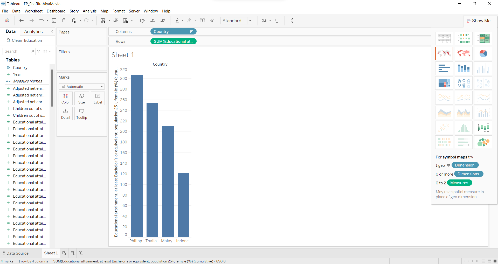
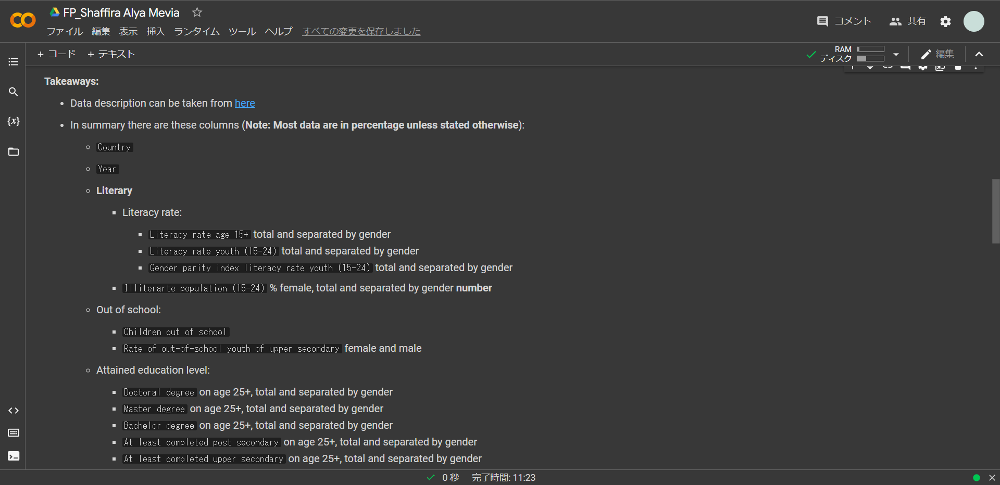
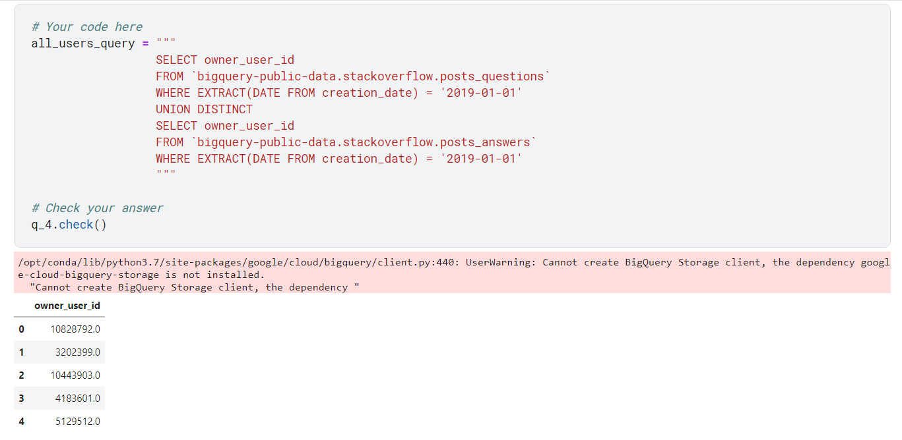
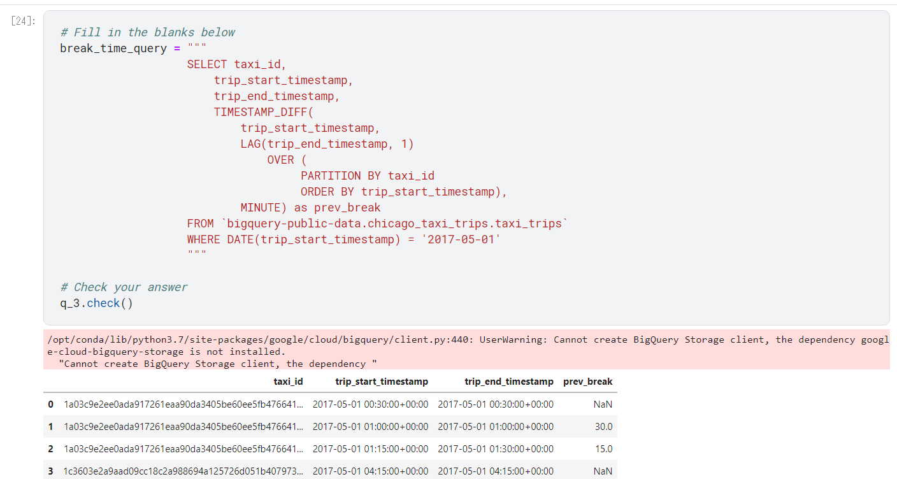
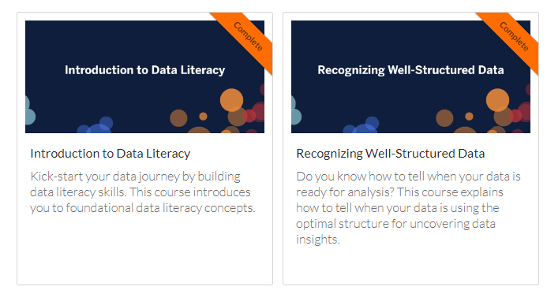
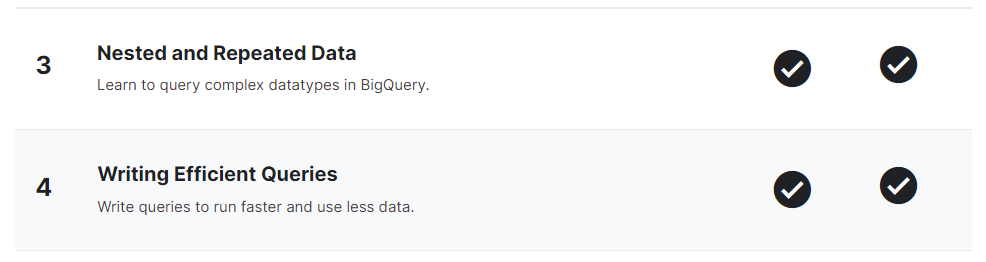
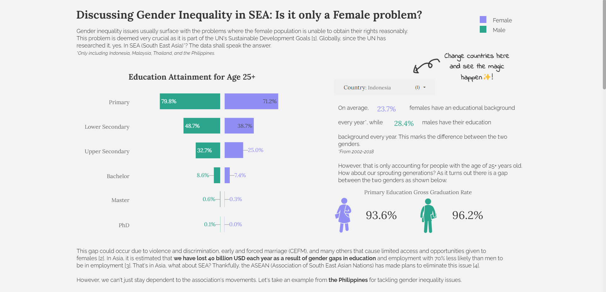

# 66Days-DataAnalytics

Sharing my journey of #66DaysOfData on learning data analytics!

| Index | Resouce                                                                   |
| ----- | ------------------------------------------------------------------------- |
| 1     | [Kaggle Intro to SQL](https://www.kaggle.com/learn/intro-to-sql)          |
| 2     | [Kaggle Advanced SQL](https://www.kaggle.com/learn/advanced-sql)          |
| 3     | [FreeCodeCamp Data Analysis](https://www.youtube.com/watch?v=r-uOLxNrNk8) |
| 4     | [FreeCodeCamp Tableau](https://www.youtube.com/watch?v=TPMlZxRRaBQ)       |
| 5     | [Tableau eLearning](https://elearning.tableau.com/)                       |

> **Day 1 of 66DaysOfData**

- **Big Query:** Using Google Cloud Big Query to understand the basics of data such as the table, fields, and how to list each item.
- **SQL:** Learned how to use `SELECT`, `FROM`, `WHERE`, `GROUP BY`, `HAVING`, `COUNT`, and `ORDER BY`. I noticed the similarity between `WHERE` and `HAVING`. The clause `WHERE` works on every row on the table whereas the clause `HAVING` works for aggregated data generated by `GROUP BY`.
- Resources:
  - [Kaggle Intro to SQL](https://www.kaggle.com/learn/intro-to-sql)

> **Day 2 of 66DaysOfData**

- **SQL**: Learned how to use `WITH...AS`, `LIKE`, and `JOIN` functions.
- **Tableau**: Experimented with the application. Still working on to do the Explanatory Data Analysis (EDA) on Google Colab because I have prior experience with it.
- Resources:
  - [Kaggle Intro to SQL](https://www.kaggle.com/learn/intro-to-sql)

> **Day 3 of 66DaysOfData**

- **SQL**: Learned how to use different types of `JOIN` functions and `UNION`. Both are quite similar in terms of usage, however the `JOIN` functions combine tables while `UNION` function combines queries.
- Resources:
  - [Kaggle Advanced SQL](https://www.kaggle.com/learn/advanced-sql)

> **Day 4 of 66DaysOfData**

- **SQL**: Learned how to use SQL analytics functions such as `AVG`, `SUM`, `MAX`, and `MIN` with the help of the `OVER` function. There are more analytical navigation functions such as `LAG` and `LEAD` that will correspond to the before or after the entry within the table. There was also the `RANK` functions that gives a ranking to the table.
- Resources:
  - [Kaggle Advanced SQL](https://www.kaggle.com/learn/advanced-sql)

> **Day 5 of 66Days of Data**

- **Data Literacy** is the ability to explore, understand, and communicate with data.

  When doing this process, it is important we ask good questions. Good questions are specific, narrow, and targetered. For example, "How are the health benefits for a dog owner compared to non dog owners in the US?" is considered a good question compared to "How beneficial is having a dog in our lifestyle?". Good questions come from several characteristics such as interest, curiosity, immagination, open mindness and flexibility, methodological, data analysis, and more.

  Ultimately, within data literacy, we try to work our processes with data, but what is "data"? Data is composed of facts that consists of qualitative or quantitative characteristics.

- **Well Structured Data** includes characteristics such as volume (contains a large amount of data for analysis), clarity (information and labels contained are clear and does not use unnecessary codes or uncommon acronyms), history (contains data that have a big time range), transparency (the source of the data is transparent to everyone), and consistency (data values and types are consistent throughout the dataset).

  Structually, each column within the data represents a type of an observations with values and different types should go to different columns.

  There are two ways to handle unstructured data, pivot and split. Pivot is to turn columns into rows and vice versa. While split is to split values from one column into two, and so on depending on the needs.

- Resources:
  - [Tableau eLearning](https://elearning.tableau.com/)

> **Day 6 of 66DaysOfData**

- **SQL**: Learned about REPEATED values and RECORD types in SQL schemas. Also, understanding how to extracted them with the `UNNEST` command. Ended the study with learning how to write efficient queries. Several ways to do this includes to filter the important fields before doing a join and to not use a 1:1 join.
- Resources:

  - [Kaggle Advanced SQL](https://www.kaggle.com/learn/advanced-sql)

  

  > **Brief Break**

  I did a little break from this challenge, however during the time I learned how to use **Google Data Studio**. This is the first visualization I have made! _p.s. I am quite happy with it._

  
  _This is just a preview and not the full viz._

  [Visualization Link](https://datastudio.google.com/reporting/062c342c-52ab-4c3d-b4a2-d1170fbe93bd)

> **Day 7 of 66DaysOfData**

- **Variable types** are split between <ins>qualitative</ins> and <ins>quantitative</ins>. Qualitative types are divided into two groups based on if they can be ranked or not, nominal (cannot be ranked) and ordinal (can be ranked) types. Examples of a nominal value is the names of a fruit while an ordinal value are the options for customer satisfaction survey (amusing or disappointing).

When creation the visualization for these types, we can aggregate quantitative values (such as with average or sum).

- Resources:
  - [Tableau eLearning](https://elearning.tableau.com/)
